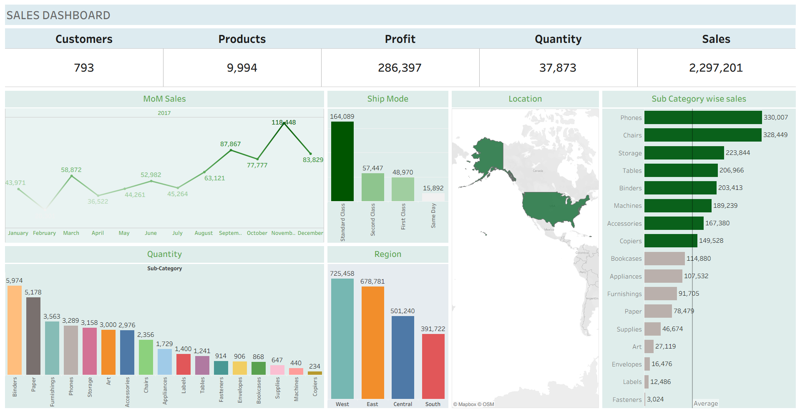

# Sales Dashboard - Tableau

## 📊 Project Overview
This project is a **Sales Dashboard** built using Tableau to analyze sales performance across customers, products, regions, and sub-categories.  
The dataset used is the *Sample Superstore Dataset*.

## 🔑 Key Insights
- Total Sales: $2.29M  
- Total Profit: $286K  
- Total Customers: 793  
- Best Performing Sub-Categories: Phones & Chairs  
- West Region generated the highest revenue.

## 📸 Dashboard Preview

## 📂 Files
- `Sales.tbwx` → Tableau workbook file  
- `Sample - Superstore.xls` → Dataset used  
- `sales_dashboard.png` → Dashboard snapshot  

## 🚀 Tools Used
- Tableau  
- Excel  

## 🌐 Live Interactive Dashboard
👉 [Click here to view the dashboard on Tableau Public](https://public.tableau.com/views/Sales_17556362286160/SalesDashboards?:language=en-US&publish=yes&:sid=&:redirect=auth&:display_count=n&:origin=viz_share_link)

---
✨ Feel free to fork this repo and try the dashboard on your own.
